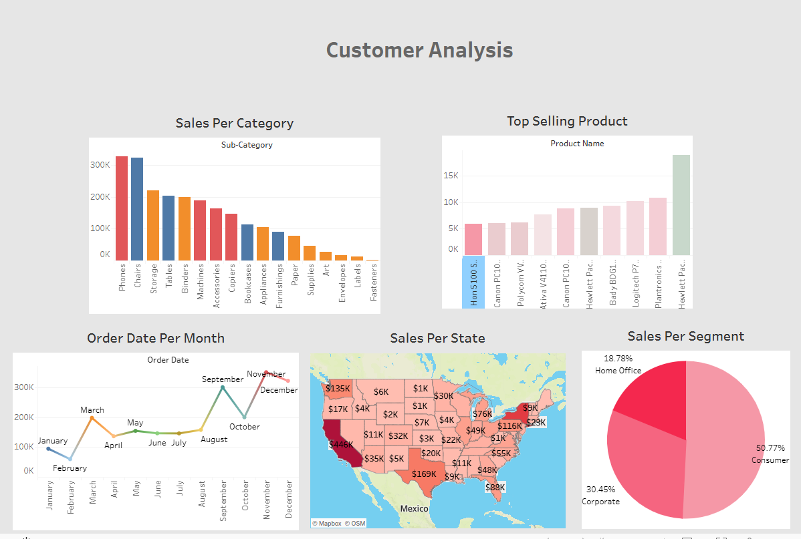

# 📊 Sales Analysis

Proyek analisis data penjualan menggunakan Python untuk melakukan Exploratory Data Analysis (EDA) dan visualisasi insight bisnis.

## 🖼️ Dashboard Preview



## 🔧 Teknologi yang Digunakan

- **Python** - Bahasa pemrograman utama
- **Pandas** - Manipulasi dan analisis data
- **Matplotlib** - Visualisasi data
- **NumPy** - Komputasi numerik
- **Tableau** - Business Intelligence Dashboard

## 📂 Struktur Proyek

```
Sales Analysis/
├── Sales.py                      # Script analisis data utama
├── exploratory_data_analysis.py  # Script EDA lengkap
├── train.csv                     # Dataset penjualan
├── Book1.twb                     # Tableau Workbook
├── Dashboard.png                 # Preview dashboard
└── README.md                     # Dokumentasi proyek
```

## 📈 Fitur Analisis

- Data cleaning dan preprocessing
- Penanganan missing values dan outliers
- Visualisasi top customers, states, dan cities
- Analisis kategori produk dan revenue
- Segmentasi pelanggan
- Dashboard interaktif dengan Tableau

## 🚀 Cara Menjalankan

1. Clone repository ini
2. Install dependencies:
   ```bash
   pip install pandas matplotlib numpy
   ```
3. Jalankan script analisis:
   ```bash
   python exploratory_data_analysis.py
   ```

## 📝 Lisensi

Proyek ini dibuat untuk keperluan pembelajaran dan analisis data.
